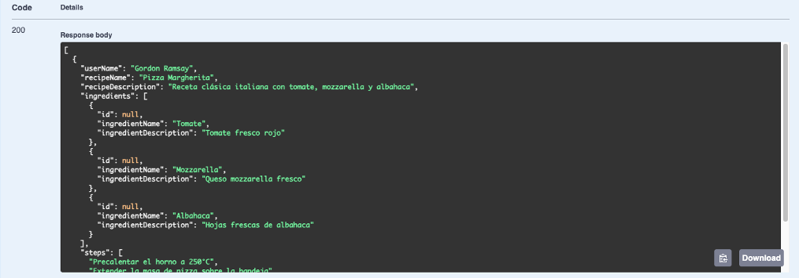
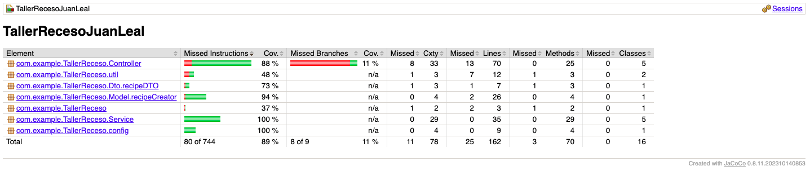

# Taller de Receso - Masterchef

**Estudiante**

Juan Carlos Leal Cruz

___

## Descripción del proyecto

Este proyecto desarrolla la API central para el programa de televisión Masterchef celebrity.

El objetivo es permitir que todos los televidentes consulten, aprendan y publiquen recetas que hayan aparecido a lo largo de las temporadas, generando un espacio interactivo para la comunidad.
La API está diseñada y mantenida inicialmente por DOSW Company como solución modular y escalable para la Fase 1 de la plataforma.

**Solución propuesta**

La solución propuesta consiste en el diseño y desarrollo de una API REST modular que gestiona recetas de cocina para el sitio web oficial de un reconocido programa de telerrealidad gastronómico.
Esta API permite a televidentes, participantes y chefs del programa registrar, consultar, editar y eliminar recetas, así como buscar recetas por ingredientes, temporada y rol de usuario, ofreciendo una experiencia interactiva y escalable para toda la comunidad.

La arquitectura implementada sigue buenas prácticas de desarrollo con Spring Boot y MongoDB, estructurando entidades, servicios y controladores para un mantenimiento sencillo y robusto.
Cada receta está compuesta por título, descripción, ingredientes, pasos, autor y metadatos relevantes (rol y temporada si aplica), permitiendo una integración transparente entre futuras funcionalidades y otros sistemas.

___

## Arquitectura de la API

Los componentes principales de la API Rest propuesta son los siguientes documentos:

- `Ingredient`: Corresponde a todos los ingredientes que se tienen al momento de la preparación
- `Chef`: Hace referencia a los chefs del programa
- `Participant`: Hace referencia a los participantes del programa de cocina
- `KitchenObserver`: Hace referencia a los televidentes, quientes también pueden proponer recetas
- `Recipe`: La clase principal de toda la API, hace referencia a las recetas que se crean durante el show

**Estructura de las recetas**

- Nombre de la receta
- Lista de ingredientes
- Pasos detallados de preparación
- Nombre (y rol) del chef: concursante, jurado o televidente
- Temporada a la que pertenece
- Identificador único y metadatos adicionales para segmentación y búsqueda
___
# Instrucciones de instalación y ejecución local

**Requisitos previos**

- JDK 17 o superior
- Maven 3.8+
- Conexión a internet

### Paso a Paso
**Clonar el Repositorio**
```
git clone https://github.com/JuanLeal1105/Taller_Receso_Juan_Leal
```

**Construir el proyecto**
```
mvn clean install
```

**Ejecutar la aplicación**
```
mvn spring-boot:run
```

**Acceso Local**
Una vez iniciada, la API estará disponible en: `http://localhost:8082/swagger-ui/index.html`
  
___

## Persistencia de los datos

Los documentos listados en el punto anterior, son justamente aquellos que gracias a los Endpoints creados para la API se guardan de forma correcta en una base de datos creada en Mongo DB.

___

## Ejemplos de los Endpoint

### POST - Chef

Para realizar la prueba de este Endpoint hacemos uso de Swagger, para lo cual ingresamos un JSON así:

```json
{
"id": "ch2",
"chefName": "Massimo Bottura",
"email": "massimo.bottura@osteria.com",
"role": "CHEF"
}
```

**Resultado**


### POST - KitchenObserver

Para realizar la prueba de este Endpoint hacemos uso de Swagger, para lo cual ingresamos un JSON así:

```json
{
  "id": "obs1",
  "observerName": "John Doe",
  "observerEmail": "john.doe@kitchen.com",
  "role": "OBSERVER"
}
```

**Resultado**


### POST - Participant

Para realizar la prueba de este Endpoint hacemos uso de Swagger, para lo cual ingresamos un JSON así:

```json
{
  "id": "part1",
  "participantName": "Alice Johnson",
  "participantEmail": "alice.johnson@kitchen.com",
  "role": "PARTICIPANT"
}
```

**Resultado**


### POST - Ingredient

Para realizar la prueba de este Endpoint hacemos uso de Swagger, para lo cual ingresamos un JSON así:

```json
{
  "id": "ing1",
  "ingredientName": "Tomate",
  "ingredientDescription": "Tomate fresco rojo"
}
```

**Resultado**


### POST - Recipe

Para realizar la prueba de este Endpoint hacemos uso de Swagger, para lo cual ingresamos un JSON así:

```json
{
  "userId": "ch1",
  "userName": "Gordon Ramsay",
  "recipeName": "Pizza Margherita",
  "recipeDescription": "Receta clásica italiana con tomate, mozzarella y albahaca",
  "season": "Summer",
  "kitchenRole": "CHEF",
  "details": {
    "ingredients": [
      {
        "id": "ing1",
        "ingredientName": "Tomate",
        "ingredientDescription": "Tomate fresco rojo"
      },
      {
        "id": "ing2",
        "ingredientName": "Mozzarella",
        "ingredientDescription": "Queso mozzarella fresco"
      },
      {
        "id": "ing3",
        "ingredientName": "Albahaca",
        "ingredientDescription": "Hojas frescas de albahaca"
      }
    ],
    "steps": [
      "Precalentar el horno a 250°C",
      "Extender la masa de pizza sobre la bandeja",
      "Agregar tomate triturado sobre la masa",
      "Colocar la mozzarella y albahaca encima",
      "Hornear durante 10-12 minutos hasta que esté dorada"
    ]
  }
} 
```

**Resultado**


### GET - Recipe by Role



### GET - Recipe by Ingredient


### GET - Recipe by Season


____

## Despliegue del proyecto en Azure

**Url de Swagger**

https://tallersito-masterchefjuanleal-fghhfjf0ctb4hqbf.brazilsouth-01.azurewebsites.net/swagger-ui/index.html#/

**Evidencia**


### GitHub Actions

El proceso de integración y despliegue continuo funciona de la siguiente manera:
- CI: Se ejecutan pruebas automáticamente cada vez que se realiza un push o pull request en la rama develop.
- CD: El despliegue se realiza de forma automática en Azure cuando se hace un push a la rama main.
- Archivo de workflow: `.github/workflows/ci-cd.yml`

___
## Cobertura de pruebas 

A continuación presentamos la cobertura de las pruebas realizadas:

